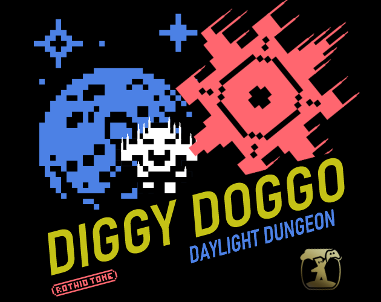
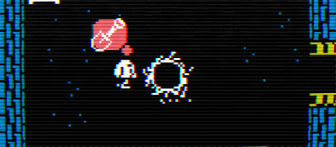

# 
# Diggy Doggo Daylight Dungeon
 

My first game using Godot Engine!

Developed entirely in one week for #IndieSpainJam23.

## Table of contents
- [About the game](#about-the-game)
- [Get the game](#get-the-game)
- [Roadmap](#roadmap)
- [Used Assets](#used-assets)
- [Used Tools](#used-tools)
- [Contributing](#contributing)
- [Thanks](#thanks)
- [License](#license)

## About the game:
Help Doggo escape from the dungeon digging a hole deep enough.

But be careful! The dungeon rooms aren't safe at night, and healing your wounds will take some time.

Try to avoid the dangers you encounter, and make sure Doggo sleeps each day with a full belly and a cozy campfire.

Fully functional with both keyboard and controller.

## Get the game:
The game is available for free on [itch.io](https://itch.io) for the following platforms:

- [GNU/Linux x86 64 bits](https://rothiotome.itch.io/diggy-doggo)
- [Windows 64 bits](https://rothiotome.itch.io/diggy-doggo)
- [WebGL](https://rothiotome.itch.io/diggy-doggo)
- [macOS](https://rothiotome.itch.io/diggy-doggo)*

*Not signed

## Roadmap:
- [x] Add spikes to enemies
- [ ] Add retry button on congratulations screen to go back to the main manu
- [ ] Add Exit button to downloadable version
- [ ] Add credits page
- [ ] Add Android version
- [ ] Adjust hole collider area to match the visuals
- [ ] Fix Main menu animation so they play when you first open the game

## Used Assets:
- **Music:** [Interstellar Music Pack](https://davidkbd.itch.io/interstellar-edm-metal-music-pack) by [DavidKBD](https://www.davidkbd.com/)
- **SFX:** [OpenGameArt](https://opengameart.org/content/sfx-the-ultimate-2017-16-bit-mini-pack) by phoenix1291
- **Sprites:** [Canari Pack 8bit TopDown](https://canarigames.itch.io/canaripack-8bit-topdown) by [Johan Vinet](https://twitter.com/johanvinet) and several tilesets by [Kenney](https://www.kenney.nl/)
- **Font:** [VT323](https://fonts.google.com/specimen/VT323) by Peter Hull

## Used Tools:
- [Godot 4](https://godotengine.org)
- [LibreSprite](https://libresprite.github.io/#!/)
- [Audacity](https://www.audacityteam.org/)

## Contributing
To get started contributing, make sure to read the [Contributing Guide](.github/CONTRIBUTING.md) before making a issue or a pull request. Also you can check the [Code of Conduct Guides](.github/CODE_OF_CONDUCT.md).

## Thanks:
Special thanks to Jynus and Endorth4 for answering all my questions about Godot while I was learning it. It wouldn't have been possible without you <3.

## License:
The source code for the site is licensed under the MIT license, which you can find in the [LICENSE](LICENSE) file.